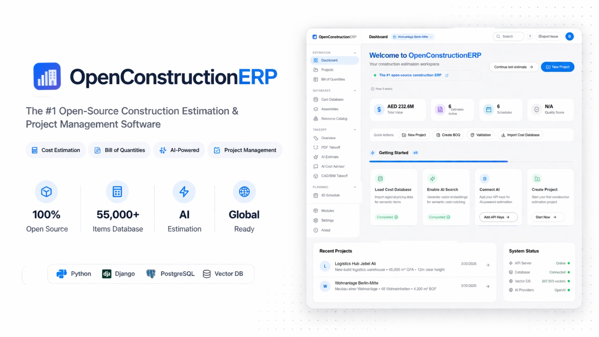
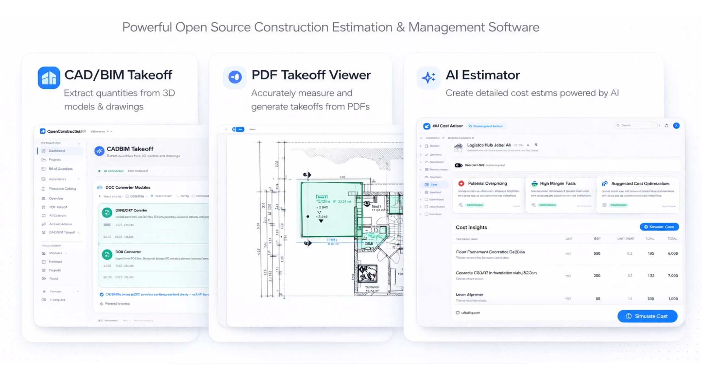

<div align="center">

# OpenConstructionERP

**The open-source cost estimation and project control platform for construction.**
BOQ, 4D/5D, CAD/BIM takeoff, AI estimating — self-hosted, on a 2 GB VPS, under one `pip install`.

[](https://pypi.org/project/openconstructionerp/)
[](LICENSE)
[](https://github.com/datadrivenconstruction/OpenConstructionERP/stargazers)
[](https://www.python.org/downloads/)
[](#features)

[Live demo](https://openconstructionerp.com/demo/) · [Documentation](https://openconstructionerp.com/docs) · [PyPI](https://pypi.org/project/openconstructionerp/) · [Discussions](https://t.me/datadrivenconstruction) · [Report an issue](https://github.com/datadrivenconstruction/OpenConstructionERP/issues)



</div>

---

## Quick start

Three commands. No Docker. No database to provision. The frontend is bundled inside the wheel.

```bash
pip install openconstructionerp
openestimate init-db
openestimate serve
```

Open **http://localhost:8080** and log in with `demo@openestimator.io` / `DemoPass1234!`.

First run takes 10-30 seconds to create the SQLite database and seed five demo projects
(Berlin, London, New York, Paris, Dubai). Subsequent runs start in 2-3 seconds. Runs comfortably
on a 2 GB VPS.

<details>
<summary><b>Other install options</b></summary>

**Open browser automatically**
```bash
openestimate serve --open
```

**Custom port or data directory**
```bash
openestimate serve --port 9000 --data-dir ~/my-erp-data
```

**Docker (PostgreSQL + Redis + MinIO)**
```bash
git clone https://github.com/datadrivenconstruction/OpenConstructionERP.git
cd OpenConstructionERP
make quickstart
```

**One-line installer (Linux / macOS)**
```bash
curl -sSL https://raw.githubusercontent.com/datadrivenconstruction/OpenConstructionERP/main/scripts/install.sh | bash
```

**Windows (PowerShell)**
```powershell
irm https://raw.githubusercontent.com/datadrivenconstruction/OpenConstructionERP/main/scripts/install.ps1 | iex
```

**Optional extras**
```bash
pip install 'openconstructionerp[semantic]'   # Qdrant + sentence-transformers semantic search
pip install 'openconstructionerp[cv]'         # PaddleOCR + YOLO for PDF takeoff
pip install 'openconstructionerp[server]'     # PostgreSQL + Redis + S3 for production
pip install 'openconstructionerp[all]'        # Everything
```

</details>

---

## Live demo

| | |
|---|---|
| **URL** | https://openconstructionerp.com/demo/ |
| **Email** | `demo@openestimator.io` |
| **Password** | `DemoPass1234!` |

The demo runs the same build as PyPI. Data resets periodically. Personal information is
stripped from user records in demo mode.

---

## Why OpenConstructionERP

- **It is actually self-hostable.** One `pip install`, SQLite by default, frontend bundled in the
  wheel. No docker-compose hunt, no managed Postgres, no SaaS fallback when you run out of credits.
- **The data is already inside.** Ten regional CWICR cost databases (USA, UK, DE, FR, ES, PT, RU,
  AE, KSA, CA), 55,000+ items each. A 55,719-item region loads in ~19 seconds. Five full demo
  projects are seeded on first run.
- **Standards are native, not an import quirk.** DIN 276, NRM 1 & 2, CSI MasterFormat, GAEB XML
  3.3, DPGF, ГЭСН, GB/T 50500 — built into the validation engine and the BOQ editor, not bolted on.
- **AI is bring-your-own-key.** Thirteen LLM providers wired in through a single HTTP client. No
  vendor SDK bloat, no forced OpenAI dependency, keys live on your server. The ERP Chat has 11
  specialised tools that query your real project data — not a chatbot glued onto a landing page.

---

## Features

**56 modules, 43 with persistent models. Auto-discovered, manifest-based, replaceable.**

### Core estimation

| | |
|---|---|
| **Bill of Quantities** | Hierarchical positions, assemblies, real-time roll-ups. AG Grid inline edit, undo/redo, keyboard nav. DIN 276 / NRM / MasterFormat on every position. |
| **Cost Database** | 10 regional CWICR databases (USA, UK, DE, FR, ES, PT, RU, AE, KSA, CA), 55,000+ items each. Vector semantic search. A full region imports in ~19 seconds. |
| **Assemblies** | Reusable cost recipes with regional factors. One-click apply to BOQ, components auto-expand into labour / material / equipment. |
| **Resource Catalog** | 7,000+ materials, equipment, labour rates and operators. Excel / CSV import. |
| **Validation engine** | 42 rules across 13 rule sets — DIN 276, GAEB, NRM, MasterFormat, universal BOQ quality. Traffic-light dashboard, drill-down to source position. |
| **Change Orders** | Variations with cost and schedule impact, approval workflow. |

### CAD / BIM / takeoff

| | |
|---|---|
| **BIM Hub** | Three.js 3D viewer. RVT / IFC / DWG / DGN ingest via DDC cad2data + a custom Rust RVT parser. Handles 16,000+ elements, colour-by category / storey / type, isolate, COLLADA material preservation. |
| **Quantity Takeoff** | PDF.js viewer with calibrated scale. Click-to-measure distance / area / count, OCR dimension strings, optional AI symbol detection. |
| **Markups** | 10 annotation types. Points stored in PDF user units, so markups survive zoom and re-scale. Custom stamps. Link measurements to BOQ positions. |
| **CAD Converter** | Standalone service. DDC cad2data bridge for DWG / DGN / IFC, custom Rust parser for Revit. All formats land in a single canonical JSON. |

### AI / intelligence

| | |
|---|---|
| **AI Estimating** | Text, photo or PDF to BOQ via 13 LLM providers — OpenAI, Anthropic, Gemini, OpenRouter, Mistral, Groq, DeepSeek, Together, Fireworks, Perplexity, Cohere, xAI, Zhipu. |
| **AI Cost Advisor** | Ask pricing and methodology questions. Answers cite your cost database as context. |
| **ERP Chat** | 11 specialised tools that query your real ERP data — project summary, BOQ items, compare projects, schedule status, EVM. Per-call tool authorisation. |
| **Cost matching** | After AI drafts an estimate, match each line against your CWICR database to replace guessed rates with market prices. |
| **Project Intelligence** | Cross-module summarisation. Cached per user — never leaks between tenants. |
| **Confidence scores** | Every AI suggestion carries a 0.0-1.0 confidence score. Human review before apply. |

### Project control

| | |
|---|---|
| **4D Schedule** | SVG Gantt, day / week / month zoom, drag-to-reschedule. Full CPM with forward / backward pass, all four PMBOK dependency types, cycle detection, critical path. |
| **5D Cost Model** | Earned Value Management — SPI, CPI, EAC, variance, S-curve. SPI clamped when the time-phased PV proxy degenerates. |
| **Risk Register** | Real 5×5 probability × impact matrix. Mitigation strategies, risk-adjusted contingency. |
| **Tasks** | Assignee, due date, priority, subtasks, attachments. |
| **Reporting** | KPI dashboards, 12 built-in templates, PDF / Excel / GAEB XML export. |
| **Budget & snapshots** | Set baselines, compare snapshots, what-if scenarios. |

### Procurement

| | |
|---|---|
| **Tendering** | Bid packages, distribution, side-by-side comparison, award recommendation. |
| **RFQ & Bidding** | Structured RFQs, supplier responses, scored comparison. |
| **Procurement** | Purchase orders, goods receipts, invoice matching. |
| **Contacts** | Vendors, subcontractors, clients. CSV import with template. |
| **Finance** | Cost codes, budget lines, actuals, commitments. |

### Document control

| | |
|---|---|
| **Document Management** | ISO 19650 CDE. WIP → Shared → Published → Archived workflow. OpenCDE BCF 3.0 compliant. |
| **RFIs & Submittals** | Structured RFI workflow, submittal log, transmittals, correspondence register. |
| **Meetings** | Minutes, action items, AI transcript import from Teams / Meet / Zoom, PDF export. |
| **Requirements** | EAC (Entity-Attribute-Constraint) triplets. Four quality gates: Completeness → Consistency → Coverage → Compliance. Linked to BOQ positions. |
| **Field Reports** | Daily site reports with photo attachments. |

### Quality & safety

| | |
|---|---|
| **Safety** | Incident register, severity, root cause, corrective actions, Excel export. |
| **Inspections** | Checklists, pass / fail, photo evidence, scheduled re-inspection. |
| **Punch List** | 5-stage workflow, pin location on PDFs, priority, photo attachments, PDF export. Verification requires a different user than the resolver. |
| **NCRs** | Non-Conformance Reports with disposition and close-out. |
| **Audit logging** | Who changed what, when, from which IP. |

### Platform

| | |
|---|---|
| **21 languages** | Full UI translation, RTL support for Arabic, locale-aware formatting. |
| **Multi-tenancy** | PostgreSQL RLS, per-tenant isolation, ownership checks on every project-touching endpoint. |
| **Modules = plugins** | Drop a module package into `backend/app/modules/`, restart, done. Each module has its own manifest, migrations and permissions. |

<div align="center">

<br><i>BOQ editor: hierarchical positions, inline edit, validation.</i>
<br><br>

<br><i>10 regional CWICR cost databases, 55,000+ items per region.</i>
<br><br>

<br><i>CAD/BIM takeoff and AI estimating from text, photo or PDF.</i>
</div>

---

## How it compares

| Capability | OpenConstructionERP | iTWO / RIB cx | Sage Estimating | HeavyBid |
|---|:---:|:---:|:---:|:---:|
| License | AGPL-3.0 | Proprietary | Proprietary | Proprietary |
| Self-hosted | Yes | No (cloud) | On-prem only | On-prem only |
| Price | Free | €400-1200/seat/mo | €200-500/seat/mo | €300-800/seat/mo |
| One-command install | `pip install` | Multi-day setup | Installer + SQL Server | Installer |
| Cost DB included | 10 regions × 55k items | Extra | Extra | US only |
| UI languages | 21 | 3-5 | 2 | 1 |
| Regional standards | DIN / NRM / MasterFormat / GAEB native | DIN / GAEB | MasterFormat | CSI |
| AI estimating | 13 LLM providers | No | No | No |
| BIM ingest | RVT / IFC / DWG / DGN | IFC + RVT | No | No |
| 4D schedule + CPM | Yes | Yes | No | Yes |
| 5D (EVM) | Yes | Yes | Limited | Yes |
| REST API | Full | Limited | Limited | No |
| Runs on 2 GB VPS | Yes | No | No | No |

---

## Tech stack

| Layer | Technology |
|---|---|
| Backend | Python 3.12+, FastAPI, Pydantic v2, SQLAlchemy 2 async |
| Frontend | React 18, TypeScript (strict), Vite, Tailwind, Zustand, React Query, AG Grid, PDF.js, Three.js |
| Database | SQLite (default), PostgreSQL 16+ (production), Alembic migrations |
| Vector search | LanceDB (embedded) or Qdrant (production) |
| AI | Any of 13 LLM providers via a single `httpx` client — no vendor SDKs |
| CAD / BIM | DDC cad2data bridge + custom Rust RVT parser, canonical JSON format |
| i18n | i18next, 21 languages including RTL Arabic |
| Background jobs | Celery + Redis (optional) or in-process (dev) |

---

## Architecture

OpenConstructionERP is a modular monolith. The backend auto-discovers modules in
`backend/app/modules/`. Each module is a self-contained Python package with `manifest.py`,
`models.py`, `schemas.py`, `router.py`, `service.py`, `repository.py`. Routes mount at
`/api/v1/{module_name}/`. Install a module by dropping it into the modules folder and restarting.

```
  Frontend (React SPA, bundled in the Python wheel)
         |
         | REST /api/v1
         v
  FastAPI app factory
         |
         +--- Core: module loader | event bus | hook registry | RBAC | validation engine
         |
         +--- 56 auto-discovered modules
         |      BOQ | Costs | Assemblies | Catalog | Validation | BIM Hub | Takeoff |
         |      Markups | AI Estimating | ERP Chat | Schedule | Cost Model | Risk |
         |      Tendering | RFQ | Procurement | Contacts | Finance | Documents |
         |      RFIs | Submittals | Meetings | Safety | Inspections | Punch List | ...
         v
  Database (SQLite dev  /  PostgreSQL 16+ production)
  Vector DB (LanceDB embedded  /  Qdrant production)
  File storage (local filesystem  /  MinIO / S3)
```

Principles: validation is first-class (no import without validation), CAD-agnostic via conversion
to a single canonical format, AI-augmented with human confirmation, open data standards (GAEB XML
3.3, DIN 276, NRM, MasterFormat), PostgreSQL as the only hard dependency. See [CLAUDE.md](CLAUDE.md)
for the full philosophy.

---

## Deployment

| Target | How | When to use |
|---|---|---|
| **Local desktop** | `pip install openconstructionerp` | Single user, solo estimator, offline work |
| **2 GB VPS** | `pip install openconstructionerp` behind Caddy/nginx | Small team, <10 users |
| **Docker Compose** | `make quickstart` (Postgres + Redis + MinIO) | Multi-user, local network |
| **Kubernetes** | Helm chart in `deploy/kubernetes/` | Enterprise, multi-tenant |
| **Cloud** | Any Python 3.12+ host + Postgres | Managed production |

---

## Documentation

- [User guide](https://openconstructionerp.com/docs)
- [Quickstart](https://openconstructionerp.com/docs/quickstart)
- [Module development](https://openconstructionerp.com/docs/modules)
- [API reference](http://localhost:8080/api/docs) (generated by your running instance)
- [Project philosophy](CLAUDE.md)
- [Changelog](CHANGELOG.md)

---

## Community & support

- **Star this repo** — if you find it useful, it helps others find it. 15,000+ GitHub clones in
  the last six months.
- **[Telegram discussions](https://t.me/datadrivenconstruction)** — questions, ideas, show and tell.
- **[GitHub issues](https://github.com/datadrivenconstruction/OpenConstructionERP/issues)** — bugs
  and feature requests. Include `openestimate doctor` output for install issues.
- **[Commercial support](https://datadrivenconstruction.io/contact-support/)** — custom
  deployment, training, enterprise licensing.

---

## Contributing

Pull requests welcome. See [CONTRIBUTING.md](CONTRIBUTING.md) for code style, commit conventions
and the PR process. Backend uses `ruff` + `pytest`; frontend uses ESLint + Prettier + Vitest.

### Contributors

Thanks to everyone who has reported bugs, walked us through real workflows, or just tried it
and written back.

- [@migfrazao2003](https://github.com/migfrazao2003) — found and cleanly reproduced the PostgreSQL
  quickstart bug ([#42](https://github.com/datadrivenconstruction/OpenConstructionERP/issues/42))
  that was blocking the headline `make quickstart` install path. The repro led directly to the
  v1.3.12 fix.
- [@maher00746](https://github.com/maher00746) — opened
  [#44](https://github.com/datadrivenconstruction/OpenConstructionERP/issues/44) asking about
  cost-database provenance, which pushed us to properly document where CWICR data comes from
  and how accurate it is.

If you have contributed and are not listed here, open an issue or PR — we want to credit everyone.

---

## License

**AGPL-3.0** — see [LICENSE](LICENSE). You can use, modify and distribute this freely. If you run
a modified version as a network service, you must make your source available under the same terms.

For commercial licensing without AGPL obligations, contact
[info@datadrivenconstruction.io](mailto:info@datadrivenconstruction.io).

---

<div align="center">

Built by [Artem Boiko](https://www.linkedin.com/in/boikoartem/) — 10+ years in construction cost
estimation, author of CWICR (55,000+ items, 9 languages) and the DDC cad2data pipeline.

[Website](https://datadrivenconstruction.io) · [LinkedIn](https://www.linkedin.com/in/boikoartem/) · [YouTube](https://www.youtube.com/@datadrivenconstruction) · [GitHub](https://github.com/datadrivenconstruction)

<sub>OpenConstructionERP v1.3.18 · AGPL-3.0 · Python 3.12+</sub>

</div>
